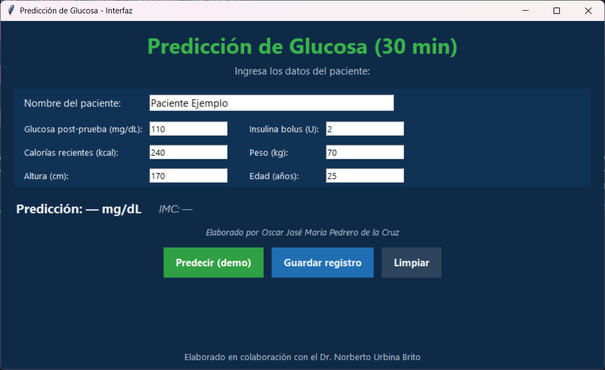
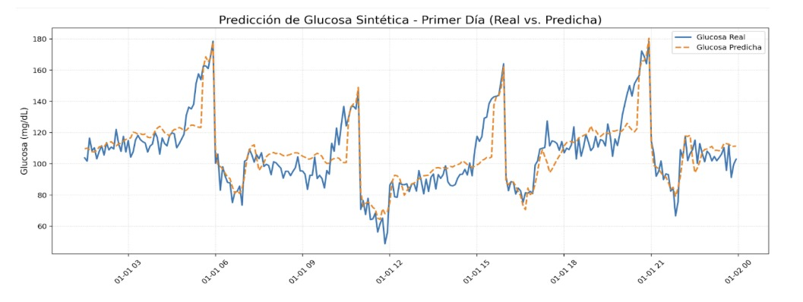

# 🧪📈 Predicción no Invasiva de Glucosa en Pacientes con Diabetes Tipo 1 Mediante LSTM

Este repositorio contiene el código fuente y los materiales para el proyecto de investigación sobre la predicción de niveles de glucosa en sangre con **30 minutos de antelación**, enfocado en pacientes con diabetes tipo 1.

## 📜 Resumen del Proyecto

Este proyecto desarrolla un sistema no invasivo y eficiente que utiliza redes neuronales **Long Short-Term Memory (LSTM)** para predecir los niveles de glucosa.

El modelo utiliza antecedentes y datos recopilados del paciente (como datos de Monitoreo Continuo de Glucosa (MCG), insulina y carbohidratos) para anticipar posibles episodios de hipoglucemia o hiperglucemia. Los resultados del modelo LSTM demuestran una alta precisión, confirmando su potencial para aplicaciones de monitoreo continuo no invasivo.

## 📂 Archivos del Repositorio

* `🧠 train_model.py`: Script principal para el preprocesamiento de datos, la construcción del modelo LSTM, el entrenamiento y la evaluación.
* `💻 app.py`: Interfaz gráfica de usuario (GUI) desarrollada con Tkinter para realizar predicciones (demo) e ingresar datos del paciente.
* `📄 CIMCYT2025_Ibanez_Glucosa.pdf`: Artículo de investigación que describe el proyecto, la metodología y los resultados (ubicado en la carpeta `/docs/`).
* `📦 requirements.txt`: Lista de dependencias de Python necesarias para ejecutar el proyecto.

## ⚙️ Instalación

Sigue estos pasos para configurar el proyecto en tu máquina local.

1.  **📥 Clona este repositorio:**
    ```bash
    git clone https://github.com/TU-USUARIO/prediccion-glucosa-lstm.git
    cd prediccion-glucosa-lstm
    ```
    *(Recuerda cambiar `TU-USUARIO` por tu nombre de usuario de GitHub)*

2.  **🌐 (Recomendado) Crea un entorno virtual:**
    Esto aísla las librerías de tu proyecto del resto de tu sistema.
    ```bash
    python -m venv venv
    source venv/bin/activate  # En Windows: venv\Scripts\activate
    ```

3.  **🛠️ Instala las librerías necesarias:**
    ```bash
    pip install -r requirements.txt
    ```

## 🚀 Uso

El flujo de trabajo del proyecto se divide en entrenar el modelo y ejecutar la interfaz.

### 1. 💾 Obtener los Datos

Este proyecto utiliza el dataset "DiaData".

> **⚠️ ¡Importante!**
> Los datos no están incluidos en este repositorio. Debes **descargar el dataset por tu cuenta** y colocar los archivos `.csv` dentro de la carpeta `/data/`.
>
> Una vez tengas los datos, abre el archivo `train_model.py` y actualiza la siguiente línea con la ruta a tu carpeta de datos (o asegúrate de que apunte a la carpeta `/data/`):
> ```python
> # Línea 17 (aprox) en train_model.py
> DATA_DIR = r"data" # O r"C:\RUTA\A\TU\CARPETA\DiaData"
> ```

### 2. 🧠 Entrenamiento del Modelo

Para entrenar el modelo desde cero, ejecuta el script 'train_model.py' desde tu terminal:

```bash
python train_model.py
```

Esto procesará los datos y creará una nueva carpeta llamada `outputs/` con el modelo entrenado, el escalador y los reportes de resultados.

### 3. 🖥️ Ejecutar la Interfaz Gráfica

Para lanzar la interfaz de usuario:

``bash
python app.py
```

---

## 💻 Vista Previa de la Interfaz

La interfaz gráfica (`app.py`) permite ingresar datos del paciente para realizar predicciones (demo) y guardar registros.



---

## 📊 Resultados del Modelo

Aquí se muestran algunos de los resultados clave obtenidos durante la evaluación del modelo (generados por `train_model.py`).

**Error (MSE y MAE)**
*Se observa la convergencia del modelo durante el entrenamiento.*


**Predicciones vs. Valores Reales (Test)**
*Comparativa entre los valores reales de glucosa y las predicciones del modelo en el conjunto de prueba.*


---

## 🧑‍🎓 Autores

Basado en el artículo `CIMCYT2025_Ibanez_Glucosa.pdf`:

* **Oscar Jose Maria Pedrero De La Cruz** (Universidad Politécnica de Chiapas)
* **Georgina Hernández Santiz** (Universidad Politécnica de Chiapas)
* **Dorian Alberto Ibáñez Nangüelú** (Instituto Tecnológico de Tuxtla Gutiérrez)
* **Norberto Urbina Brito** (Universidad Politécnica de Chiapas)
* **Christian Roberto Ibáñez Nangüelú** (Universidad Politécnica de Chiapas)
