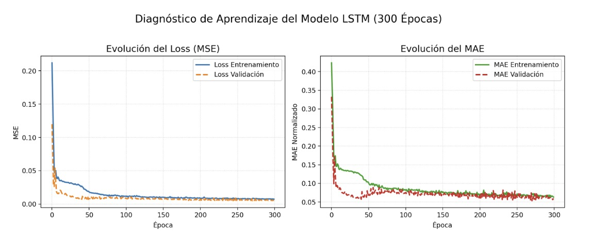
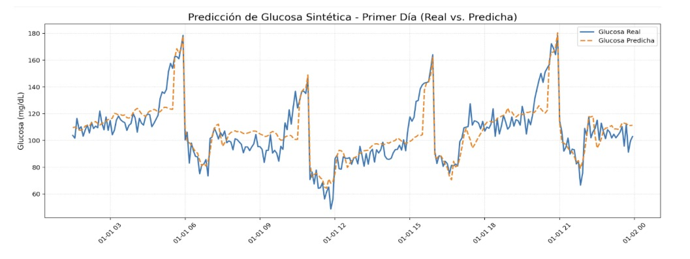

# 🧪📈 Predicción no Invasiva de Glucosa en Pacientes con Diabetes Tipo 1 Mediante LSTM

Este repositorio contiene el código fuente y los materiales para el proyecto de investigación sobre la predicción de niveles de glucosa en sangre con **30 minutos de antelación**, enfocado en pacientes con diabetes tipo 1.

## 📜 Resumen del Proyecto

Este proyecto desarrolla un sistema no invasivo y eficiente que utiliza redes neuronales **Long Short-Term Memory (LSTM)** para predecir los niveles de glucosa.

El modelo utiliza antecedentes y datos recopilados del paciente (como datos de Monitoreo Continuo de Glucosa (MCG), insulina y carbohidratos) para anticipar posibles episodios de hipoglucemia o hiperglucemia. Los resultados del modelo LSTM demuestran una alta precisión, confirmando su potencial para aplicaciones de monitoreo continuo no invasivo.

## 📂 Archivos del Repositorio

* `🧠 train_model.py`: Script principal para el preprocesamiento de datos, la construcción del modelo LSTM, el entrenamiento y la evaluación.
* `💻 app.py`: Interfaz gráfica de usuario (GUI) desarrollada con Tkinter para realizar predicciones (demo) e ingresar datos del paciente.
* `📄 CIMCYT2025_Ibanez_Glucosa.pdf`: Artículo de investigación que describe el proyecto, la metodología y los resultados.
* `📦 requirements.txt`: Lista de dependencias de Python necesarias para ejecutar el proyecto.

## ⚙️ Instalación

Sigue estos pasos para configurar el proyecto en tu máquina local.

1.  **📥 Clona este repositorio:**
    ```bash
    git clone [https://github.com/TU-USUARIO/prediccion-glucosa-lstm.git](https://github.com/TU-USUARIO/prediccion-glucosa-lstm.git)
    cd prediccion-glucosa-lstm
    ```
    *(Recuerda cambiar `TU-USUARIO` por tu nombre de usuario de GitHub)*

2.  **🌐 (Recomendado) Crea un entorno virtual:**
    Esto aísla las librerías de tu proyecto del resto de tu sistema.
    ```bash
    python -m venv venv
    source venv/bin/activate  # En Windows: venv\Scripts\activate
    ```

3.  **🛠️ Instala las librerías necesarias:**
    ```bash
    pip install -r requirements.txt
    ```

## 🚀 Uso

### 1. 💾 Obtener los Datos

Este proyecto utiliza el dataset "DiaData".

> **⚠️ ¡Importante!**
> Los datos no están incluidos en este repositorio. Debes **descargar el dataset por tu cuenta** y colocarlo en una carpeta.
>
> Una vez tengas los datos, abre el archivo `train_model.py` y actualiza la siguiente línea con la ruta a tu carpeta de datos:
> ```python
> # Línea 17 (aprox) en train_model.py
> DATA_DIR = r"C:\RUTA\A\TU\CARPETA\DiaData"
> ```

### 2. 🧠 Entrenamiento del Modelo

Para entrenar el modelo desde cero, ejecuta el script `train_model.py` desde tu terminal:

```bash
python train_model.py


### 3. 📊 Resultados del Modelo

Aquí se muestran algunos de los resultados clave obtenidos durante la evaluación del modelo en el script `train_model.py`.

**Error (MSE y MAE)**


**Predicciones vs. Valores Reales (Test)**

